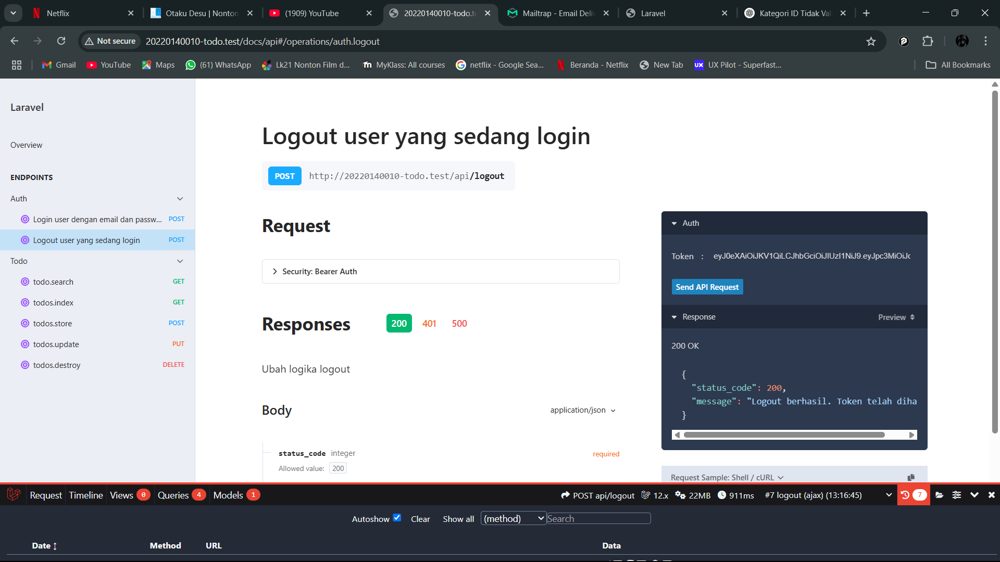
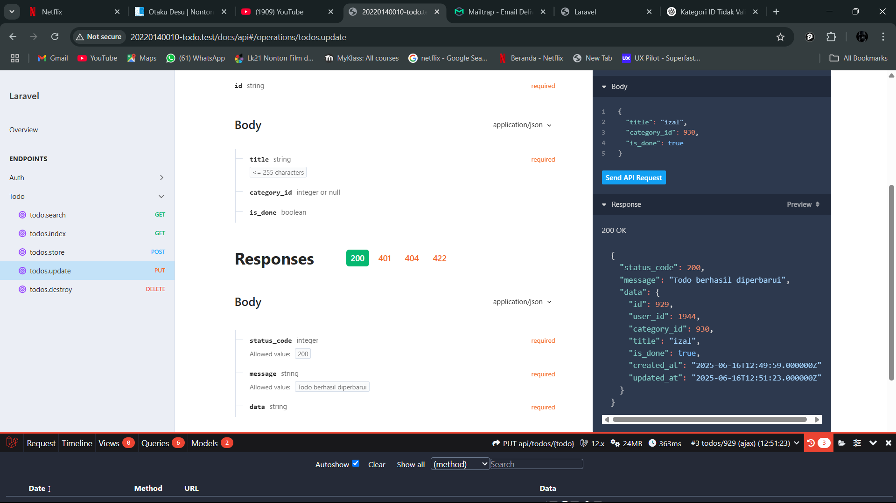
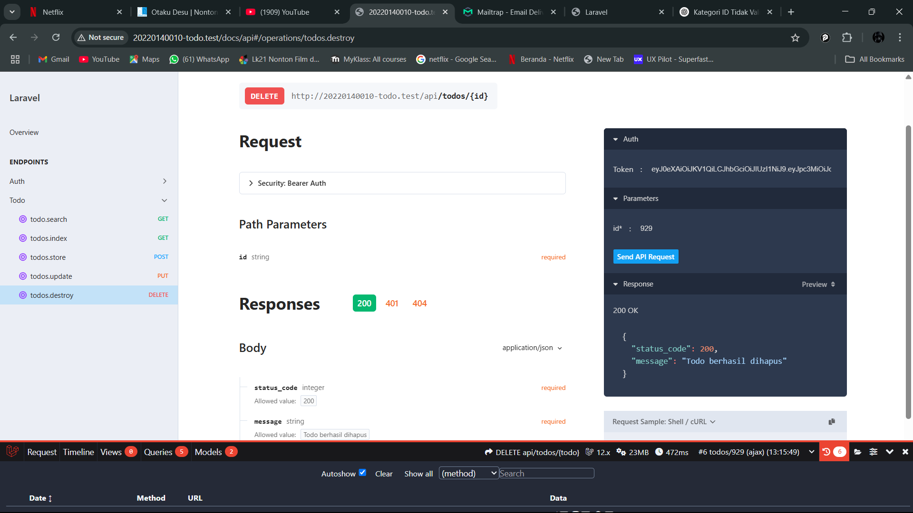
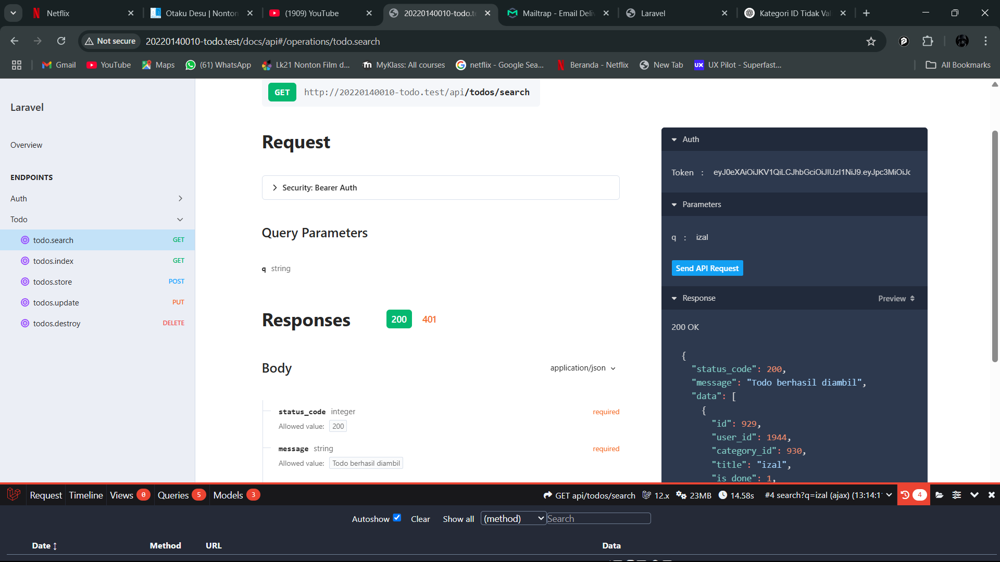

## Tugas 12

## 1. Logout

## 2. Endpoint untuk mengambil semua data Todo

## 3. Endpoint untuk menambah data Todo baru 
[alt text](ScreenShot/tugas12/Tambahdata.png)

## 4. Endpoint untuk mengubah Todo 

## 5. Endpoint untuk menghapus Todo 

## 6. Endpoint untuk melakukan pencarian pada Todo
